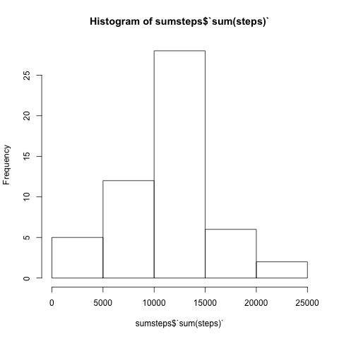
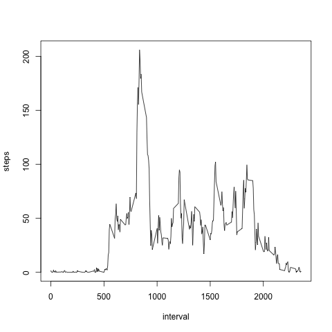
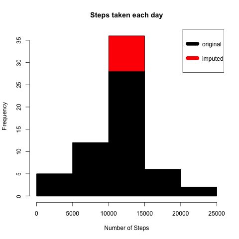
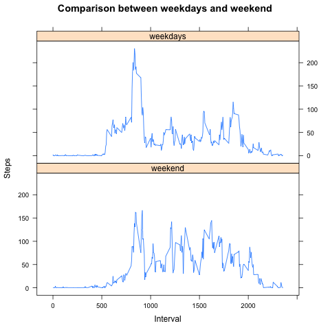

## Introduction

It is now possible to collect a large amount of data about personal
movement using activity monitoring devices such as a
[Fitbit](http://www.fitbit.com), [Nike
Fuelband](http://www.nike.com/us/en_us/c/nikeplus-fuelband), or
[Jawbone Up](https://jawbone.com/up). These type of devices are part of
the "quantified self" movement -- a group of enthusiasts who take
measurements about themselves regularly to improve their health, to
find patterns in their behavior, or because they are tech geeks. But
these data remain under-utilized both because the raw data are hard to
obtain and there is a lack of statistical methods and software for
processing and interpreting the data.

This assignment makes use of data from a personal activity monitoring
device. This device collects data at 5 minute intervals through out the
day. The data consists of two months of data from an anonymous
individual collected during the months of October and November, 2012
and include the number of steps taken in 5 minute intervals each day.

## Data

The data for this assignment can be downloaded from the course web
site:

* Dataset: [Activity monitoring data](https://d396qusza40orc.cloudfront.net/repdata%2Fdata%2Factivity.zip) [52K]

The variables included in this dataset are:

* **steps**: Number of steps taking in a 5-minute interval (missing
    values are coded as `NA`)

* **date**: The date on which the measurement was taken in YYYY-MM-DD
    format

* **interval**: Identifier for the 5-minute interval in which
    measurement was taken


The dataset is stored in a comma-separated-value (CSV) file and there
are a total of 17,568 observations in this
dataset.


## Assignment

This assignment will be described in multiple parts. You will need to
write a report that answers the questions detailed below. Ultimately,
you will need to complete the entire assignment in a **single R
markdown** document that can be processed by **knitr** and be
transformed into an HTML file.

Throughout your report make sure you always include the code that you
used to generate the output you present. When writing code chunks in
the R markdown document, always use `echo = TRUE` so that someone else
will be able to read the code. **This assignment will be evaluated via
peer assessment so it is essential that your peer evaluators be able
to review the code for your analysis**.

For the plotting aspects of this assignment, feel free to use any
plotting system in R (i.e., base, lattice, ggplot2)

Fork/clone the [GitHub repository created for this
assignment](http://github.com/rdpeng/RepData_PeerAssessment1). You
will submit this assignment by pushing your completed files into your
forked repository on GitHub. The assignment submission will consist of
the URL to your GitHub repository and the SHA-1 commit ID for your
repository state.

NOTE: The GitHub repository also contains the dataset for the
assignment so you do not have to download the data separately.


### Loading and preprocessing the data

```{r load}
rawdata <-read.csv("activity.csv")
```

### What is mean total number of steps taken per day?

- Calculate the total number of steps taken per day

```{r sum}

data <-group_by(rawdata,date)
sumsteps <-summarise(data,sum(steps))
```

- Make a histogram of the total number of steps taken each day

```{r histogram}
hist(sumsteps$`sum(steps)`,)
```

 
- Calculate and report the mean and median of the total number of steps taken per day

```{r mean,results="hide"}
s.mean<-mean(sumsteps$`sum(steps)`,na.rm=TRUE)

```
The mean is `r s.mean`.

```{r median}
r.median<-median(sumsteps$`sum(steps)`,na.rm=TRUE)
```
The median is `r r.median`.


### What is the average daily activity pattern?

```{r daily activity}
pattern <-rawdata[,c(1,3)]
pattern$interval <-as.numeric(pattern$interval)
by_interval <-aggregate(steps ~interval, data=pattern,FUN=mean)
plot(by_interval,type="l")

```
 
```{r maximum,results="hide"}
maxsteps <-summarise(by_interval,max(steps))
maxrow<-which(grepl(maxsteps,by_interval$steps))

```
In this data, the maximum of steps appears in the `r by_interval[maxrow,1]`th 5-minute interval.


### Imputing missing values

- The total number of raws including missing value
```{r the number of NA,results="hide"}
na.sum<-sum(is.na(pattern))
```
There are `r na.sum` raws including missing value.

- Filling in all of the missing values in the dataset

The strategy is to replace missing value with the average steps of the interval.
```{r filling,error=FALSE}
averagesteps<-aggregate(steps~interval,rawdata,mean)
newdata<-transform(rawdata,steps=ifelse(is.na(rawdata$steps),averagesteps$steps[match(rawdata$interval,averagesteps$interval)],rawdata$steps))
```
##compare imputed data with original data

- Calculate the average steps
```{r comparing}
totalsteps<-aggregate(steps~date,rawdata,sum)
totalsteps_new<-aggregate(steps~date,newdata,sum)
```
- Visualising the comparison

```{r steps taken each day}

hist(totalsteps_new$steps,col="red",xlab="Number of Steps",main="Steps taken each day")
hist(totalsteps$steps,col="black",add=T)
legend("topright",c("original","imputed"),col=c("black","red"),lwd=10)

```

 

- The difference between original and imputed data

```{r differences}
meansteps<-mean(totalsteps$steps)
mediansteps<-median(totalsteps$steps)
meansteps_new<-mean(totalsteps_new$steps)
mediansteps_new<-median(totalsteps_new$steps)
mean_dif <-meansteps_new-meansteps
median_dif<-mediansteps_new-mediansteps
total_dif<-sum(totalsteps_new$steps)-sum(totalsteps_new$steps)


```
1. The mean of original data is `r meansteps`
2. The mean of imputed data is `r meansteps_new`
3. The median of original data is `r mediansteps`
4. The median of imputed data is `r mediansteps_new`
5. The mean difference is `r mean_dif`.
6. The median difference is `r median_dif`.
7. The total steps difference is `r total_dif`.


### Are there differences in activity patterns between weekdays and weekends?

```{r pattern_weekdays}

newdata$date<-as.Date(newdata$date)
newdata$interval<-as.numeric(newdata$interval)

weekdays1<-c("Monday","Tuesday","Wednesday","Thursday","Friday")
newdata$day<-factor((weekdays(newdata$date) %in% weekdays1),levels=c(FALSE,TRUE),labels = c("weekend","weekdays"))
pattern_weekday<-aggregate(steps~interval+day,newdata,mean)
xyplot(pattern_weekday$steps~pattern_weekday$interval|pattern_weekday$day,main="Comparison between weekdays and weekend",xlab="Interval",ylab="Steps",layout=c(1,2),type="l")
```



## Submitting the Assignment


```r
https://github.com/Zaxizuz/RepData_PeerAssessment1

7c376cc5447f11537f8740af8e07d6facc3d9645
```
